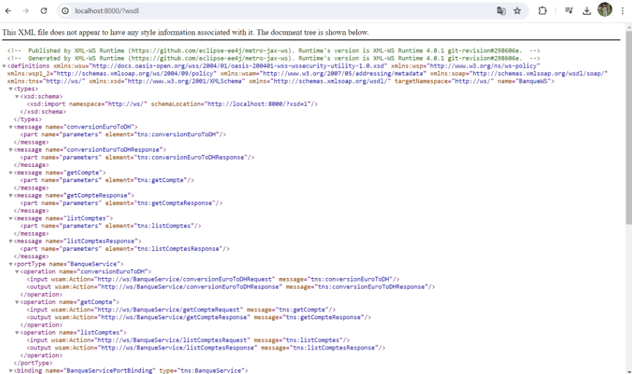

# Web Services SOAP Project

## Description

This project demonstrates the creation, deployment, and testing of a SOAP web service using Java and JAX-WS. The web service provides functionalities for currency conversion and account management.

## Table of Contents
1. [Features](#features)
2. [Prerequisites](#prerequisites)
3. [Setup and Deployment](#setup-and-deployment)
4. [WSDL Analysis](#wsdl-analysis)
5. [Testing the Web Service](#testing-the-web-service)
6. [Creating a SOAP Client](#creating-a-soap-client)
7. [Conclusion](#conclusion)

## Features

- **Currency Conversion:** Convert an amount from Euro to Moroccan Dirham (DH).
- **Account Management:** 
  - Retrieve details of a specific account.
  - Retrieve a list of all accounts.

## Prerequisites

- Java Development Kit (JDK) 8 or higher
- Apache Tomcat or any other JAX-WS compatible server
- Integrated Development Environment (IDE) such as IntelliJ IDEA or Eclipse
- SOAP-UI or Oxygen XML Editor for testing

## Setup and Deployment

### 1. Create the Web Service

```java
import javax.jws.WebMethod;
import javax.jws.WebParam;
import javax.jws.WebService;
import java.util.Date;
import java.util.List;

@WebService(serviceName = "BanqueWS")
public class BanqueService {

    @WebMethod(operationName = "conversionEuroToDh")
    public double conversionEuroToDh(@WebParam(name = "montant") double montant) {
        return montant * 11;
    }

    @WebMethod(operationName = "getCompte")
    public Compte getCompte(@WebParam(name = "code") int code) {
        return new Compte(code, Math.random() * 8000, new Date());
    }

    @WebMethod(operationName = "getComptes")
    public List<Compte> getComptes() {
        return List.of(
                new Compte(1, Math.random() * 8000, new Date()),
                new Compte(2, Math.random() * 8000, new Date())
        );
    }
}
```

### 2. Deploy the Web Service

Deploy the web service to a JAX-WS compatible server such as Apache Tomcat. Ensure the web.xml configuration is correct for deploying a SOAP service.

### 3. Analyze the WSDL

Once deployed, the WSDL file can be accessed via a browser at `http://<server-address>:<port>/BanqueWS?wsdl`.

## WSDL Analysis

Use a web browser or a tool like SOAP-UI to inspect the WSDL. The WSDL describes the available operations, data types, and the service endpoint.

## Testing the Web Service

### Using SOAP-UI

1. **Create a New SOAP Project:**
   - Enter the WSDL URL.
   - SOAP-UI will automatically create the request templates.

2. **Test Operations:**
   - **ConversionEuroToDh:** Test the currency conversion operation.
   - **GetCompte:** Retrieve a specific account.
   - **GetComptes:** Retrieve the list of accounts.



## Creating a SOAP Client

### 1. Generate the Stub

Use the `wsimport` tool to generate Java classes from the WSDL.

```sh
wsimport -keep -verbose http://<server-address>:<port>/BanqueWS?wsdl
```

### 2. Create the Client

```java
public class BanqueClient {

    public static void main(String[] args) {
        BanqueWS service = new BanqueWSService().getBanqueWSPort();
        System.out.println("800 Euros to DH: " + service.conversionEuroToDh(800));
        System.out.println("Account 1: " + service.getCompte(1));
        service.getComptes().forEach(System.out::println);
    }
}
```

Compile and run the client to ensure it can communicate with the deployed web service.

## Conclusion

This project demonstrates the complete lifecycle of creating, deploying, and consuming a SOAP web service using Java. It covers the essential aspects including WSDL inspection and client creation, providing a comprehensive understanding of SOAP-based web services.

For further enhancements, consider implementing security features, adding more operations, or integrating with a database for persistent account management.